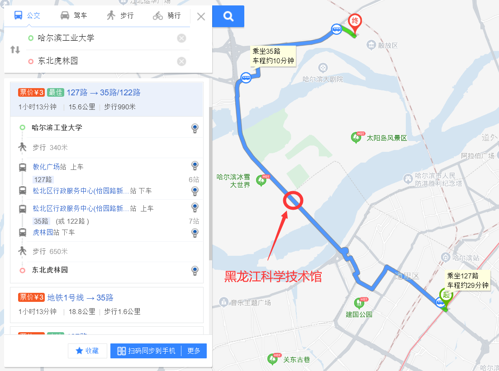
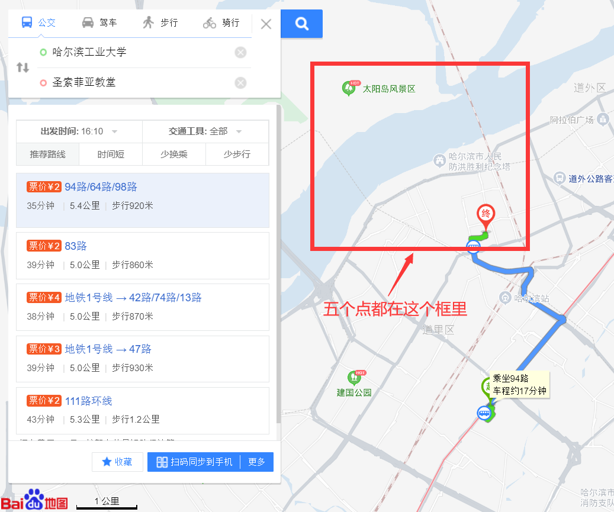

# 酒店（7/16~7/20）

## 一、汉庭酒店哈尔滨西大直街工大店

**距离**：离哈工大0.2km

**价格**：

双床含早餐单间326元/晚、无早餐262元/晚（携程）

双床含早餐单间208元/晚、无早餐164元/晚（美团）

**交通**：步行6分钟

**优势**：好评的人多

## *二、如家快捷酒店哈尔滨西大直街工大店

**距离**：哈工大0.2km

**价格**：

双床含早餐单间183元/晚（携程）

双床含早餐单间198元/晚（美团）

**交通**：步行6分钟

**优势**：便宜

## 三、汉庭酒店哈尔滨火车站广场店

**距离**：2km

**价格**：双床含早餐单间300元/晚、无早餐251元/晚（携程）

**交通**：半小时左右

## 四、汉庭酒店哈尔滨哈工大店

**距离**：哈工大0.2km

**价格**：

双床含早餐单间189元/晚（携程）

双床含早餐单间169元/晚（美团）

**劣势**：16/17已经被订完

# 吃饭（以哈工大为中心）

## 一、日韩

### 1）一护拉面

**地址**：南岗区木工街8号

**人均**：37元

**特色**：地狱拉面、豚骨拉面、寿司

### 2）天妇寿司店

**地址**：哈工大西苑餐厅正对面

**人均**：15元

**特色**：金枪鱼寿司、裸体寿司、肉松蛋黄寿司、玉米寿司

### 3）春川芝士铁板鸡

**地址**：桥东街41号-1层

**人均**：50元

**特色**：琥珀炸鸡、拉面炒年糕、芝士鸡宝宝、大酱汤

## 二、烤肉

### 1）大风吹烧烤

**地址**：教化街17号

**人均**：50元

**特色**：到那里点就完事

### 2）鞑子炭火烤羊腿

**地址**：复华四道街80号

**人均**：35元

**特色**：羊腿、羊排、烤大虾

### 3）17号炭火烤鲜肉

**地址**：木工街17号

**人均**：52元

**特色**：大片牛肉、烤蚬子、锡纸玉米等

## 三、美式简餐

### 1）快乐窗咖啡屋

**地址**：木工街2号104室

**人均**：44元

**特色**：总汇三明治、牛肉潜艇堡、重乳酪蛋糕、冰苹果肉桂

## 四、东北菜

### 最东北

**地址**：西大直街183号

**人均**：45元

**特色**：哈工大附近评价最高的东北菜馆之一。胖头鱼、番茄里脊、烤羊排、什锦野菜丸子

# 景点

***均需龙江健康码、行程码、口罩***

## 一、沿127路往西北50分钟

看老虎&逛馆子

### 1）黑龙江科学技术馆

**时间开销**：45分钟

**交通**：127路

**特色**：科技展览、现场体验等。

**门票**：免费

**tips**：需实名预约 http://www.hljstm.org.cn/portal/guest/index，刷身份证、预约二维码进馆

### 2）东北虎林园

**时间开销**：1小时/单程

**交通**：127路转35路

**特色**：最大的东北虎人工养殖基地，有成虎园、幼虎苑、科普展馆

**费用**：90元/人 持学生证半价

## 二、沿64路往北40分钟

逛俄罗斯风格建筑&松花江

### 1）圣索菲亚教堂（哈尔滨建筑艺术展览馆）

**门票**：上午免费，下午音乐会35元

### 2）中央大街

**特色**：最具代表性的步行街，两侧建筑由俄罗斯人、犹太人修建。

街上有一家马迭尔冷饮店，冰糕10元一份，酸奶5元一份（老俄罗斯口味）

### 3）防洪纪念塔

免费

### 4）斯大林公园

就在附近，免费

### 5）太阳岛

在防洪纪念塔附近乘船（往返20元）至江北，进太阳岛公园（30元）

tips：需在https://m.qulongjiang.com/appointment/index预约